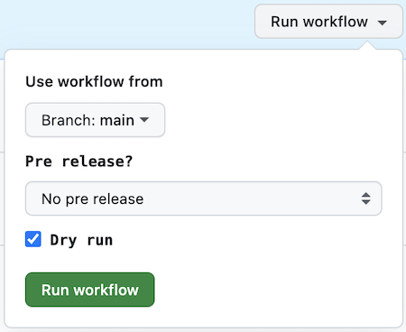

> **Warning** This repository is now archived and will not be updated

> This repository was originally published to foster collaboration and engagement with developers as they customized or developed visualizations, but due to customer feedback and usage data, it is now moved back to closed source. Moving this and other projects back to closed source will support better integration with internal build and test tooling, and free up resources for investment in these and other visualizations.

# nebula.js list visualizations

- [sn-filter-pane](./packages/sn-filter-pane/README.md)
- sn-listbox

## Releasing

### Normal release

To create a release for both sn-listbox and sn-filter-pane, follow these steps:
1. Click this GitHub action [create-release](https://github.com/qlik-oss/sn-list-objects/actions/workflows/create-release.yaml)
2. Select the branch from which to create a release (always use *main* unless you are creating a [patch release](#patch-release))

> Note! Both sn-listbox and sn-filter-pane will be released

The script determines which digit in the version number to increment, based on the presence of `fix:` in the commmit messages' prefixes:
  - fix -> `patch`
  - other prefixes -> `minor`


### Release action dialog

> You need to be a `Collaborator` to run this workflow. 

  


#### Options:
- **Branch** – The branch to create a release from
- **Pre-release?** – Only if you want to make a pre-releases, in which case you must choose the kind of pre-release
- **Dry-run** – If dry-run is checked, packages will not be released – it is to show the commands it will execute and their outputs, upon release

> Note! With the dry-run option, read-only commands are still executed (commands prefixed with `$`), while potentially writing/mutating commands are not (commands prefixed with `!` below)

```bash
$ git rev-parse --git-dir  # executed in dry-run
.git
! git add package.json  # ignored in dry-run
! git commit --message="Release 0.8.3" # ignored in dry-run
```

### Patch release

A patch release means releasing a new version from a branch (i.e. not *main*).
The convention says that a patch release should increment the last (third) digit in the version number: `major.minor.patch`.
However, which number gets incremented is decided by the release script. Therefore, you must make sure to include merge commits which only contain `fix:` in the changes on your branch.

Follow these steps to create a patch release:

1. Find out which version you want to patch (e.g. `0.13.7` and release a patched version `0.13.8`)
2. Find the corresponding branch, named `release/0.13.x` – otherwise create it from the release commit of the version mentioned before (0.13.7)
3. Update the branch `release/0.13.x` with your fixes and prepare to release it
4. Run the release GitHub action **but make sure to select your release branch**: `release/0.13.x`
5. Use the `Dry run` option – and make sure it only bumps the last digit in the version number
6. Finally – run the release GitHub action without the `Dry run` option


Current release branches:
- [`0.13.x`](https://github.com/qlik-oss/sn-list-objects/tree/release/0.13.x)


## Api governance check

For sn-filter-pane run the [API-Governance](https://github.com/qlik-oss/sn-list-objects/actions/workflows/api-gov.yml) workflow.
To update the baseline select a release tag from the dropdown menu.
