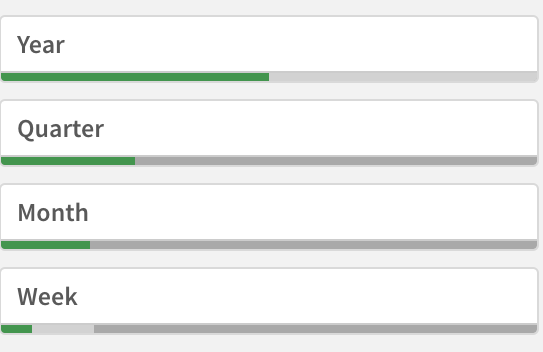
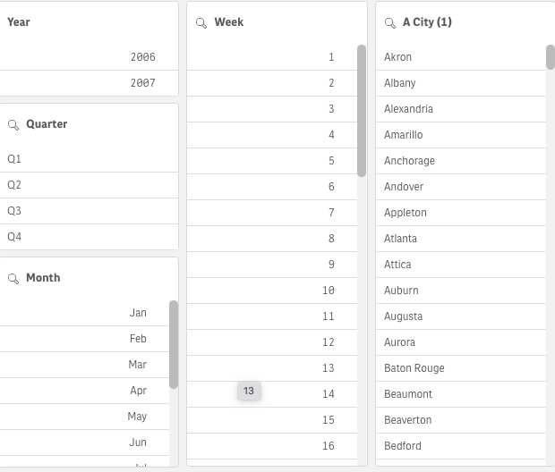
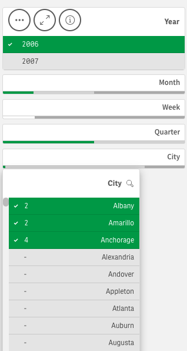
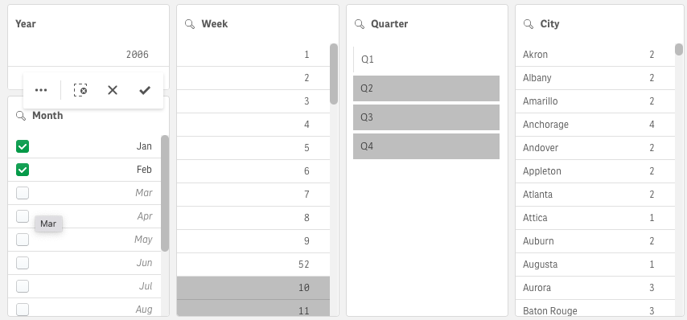
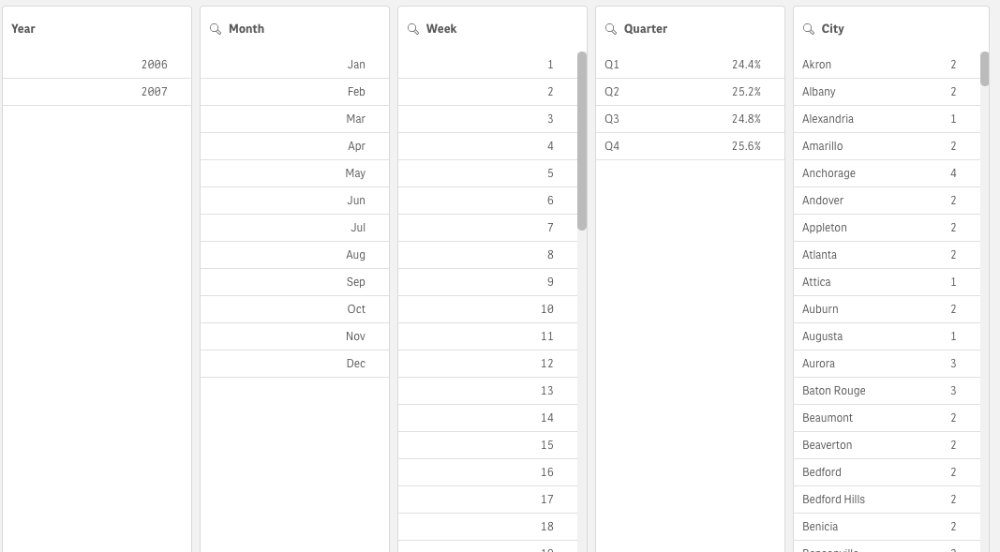
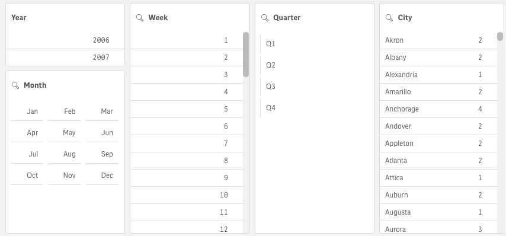
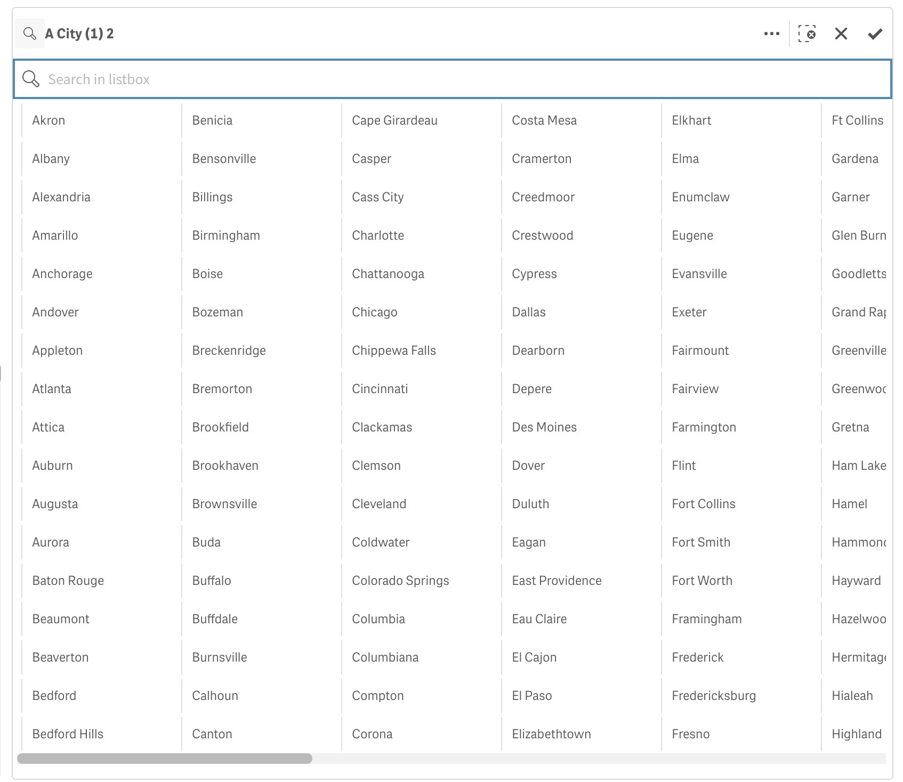

# sn-filter-pane

## A filter pane for nebula.js

You can add a filter pane to control what data is shown in the visualizations on a sheet. A filter pane can filter
the data of several dimensions at once. For example, if you have a chart of sales over time, you can use a filter pane
to limit the data in the chart to only show sales from a selected time period, from certain product categories, and from
a certain region.

Filter panes are good for making selections and defining data sets. But they also show the relationship between
different values, the associations. The green, white, and gray colors reflect the data associations that exist and
the ones that do not exist. By analyzing these associations, you can make new discoveries, for example, that a sales
representative has too many customers, or that a region lacks a sales representative.



```js
// Configure nucleus
const nuked = window.stardust.embed(app, {
  context: { theme: "light" },
  types: [
    {
      name: "filterpane",
      load: () => Promise.resolve(window["filterpane"]),
    },
  ],
});

// Rendering a filter pane
nuked.render({
  element: document.querySelector('.listbox'),
  type: "filterpane",
  fields: ["Year", "Quarter", "Month", "Week"],
});
```

With filter panes, you can easily make several selections to define your data set exactly as you want it. With your
well-defined data set, you can explore data of particular interest.
By using the selection menu options in the filter panes (select possible, select alternative, and select excluded), you
can make adjustments to the data set and compare the results with the previous selection.

## Requirements

Requires `@nebula.js/stardust` version `4.0.0` or later.

## Installing

If you use npm: `npm install @nebula.js/sn-filter-pane`.
You can also load through the script tag directly from
[https://unpkg.com](https://unpkg.com/@nebula.js/sn-filter-pane).

## Examples

### FilterPane with all dimensions expanded

When a dimension is added, it is placed to the right of the previous dimensions, or below, depending on the available
space. As long as there is enough space, the dimensions are displayed as expanded lists. If there is not enough space,
the dimensions that were added first are turned into filter panes. In a filter pane, you can use up to 1000 dimensions.



```js
nuked.render({
  element: document.querySelector('.listbox'),
  type: "filterpane",
  fields: ["Year", "Quarter", "Month", "Week", "City"],
});
```

In the example below, the filter pane is shown with collapsed listboxes for some fields as there is not enough space.


### Selections in filter pane

During analysis, you click a compressed filter pane dimension to open a selection list. When you make a selection, it is
reflected in the small bars at the bottom of each filter pane dimension. Four states can be displayed in the
bars: selected (green), possible (white), alternative (light gray), and excluded (dark gray).

Locked values are indicated by a lock icon. The details of the selections are displayed in the selections bar, at the
top of the sheet. You can click an item to see the details and change your selection. Fields are filtered out from each
dimension to be shown in the visualizations on the sheet.



### Selections using checkboxes

You can add checkboxes next to each dimension value for individual selection. You choose this with checkbox mode option
for each dimension. The selections tool offers an option to get an overview of the fields and dimensions in an app. In
the selections tool, you can make selections in all the fields and dimensions in the app, regardless of whether they are
used in the app or not.



```js
nuked.render({
  type: "filterpane",
  element: document.querySelector('.listbox'),
   fields: [
        {
        qListObjectDef: {
            qDef: {qFieldDefs: ["Month"]}
        },
        checkboxes: true,
        },
    ],
});
```

In the properties panel, you can customize the look and feel of the filter pane. Listboxes for each dimension can be
customized individually.

### Showing the frequency of values

You can show the frequency next to each value, either as an absolute number or as a percentage. You select this with
Show frequency under each dimension. In some cases, the frequency cannot be calculated and is displayed as -. One
example of this is for key fields.



```js
nuked.render({
  type: "filterpane",
  element: document.querySelector('.listbox'),
   fields: [
        {
        qListObjectDef: {
            qDef: {qFieldDefs: ["Quarter"]}
            frequencyEnabled: true 
            qFrequencyMode: "P"
        },
        },
        {
          qListObjectDef: {
            qDef: {qFieldDefs: ["City"]}
            frequencyEnabled: true 
            qFrequencyMode: "V"
        },
      },
    ],
});
```

### Listbox Layout as Grid

Each filter pane dimension can be shown as a single column or a grid. You can choose this with Show data in under
each dimension. In Grid mode, you can choose to order by row or column.



```js
nuked.render({
  type: "filterpane",
  element: document.querySelector('.listbox'),
   fields: [
      {
      qListObjectDef: {
          qDef: {qFieldDefs: ["Quarter"]}
      },
        layoutOptions: {
        dataLayout: 'grid',
        layoutOrder: 'row',
      },
      },
      {
      qListObjectDef: {
          qDef: {qFieldDefs: ["Month"]}
      },
      layoutOptions: {
        dataLayout: 'grid',
        layoutOrder: 'column',
      },
      },
  ],
});
```

### Search in Filter Pane

In the Listbox properties, you can choose whether or not users can search for individual field values in each listbox
within the filter pane. You can also switch the default Search mode from Normal to Wildcard. Wildcard adds default
wildcard symbols (*) to the search field.




## Development
### Get started

Start by cloning the repository and `cd` into it:
```bash
git clone https://github.com/qlik-oss/sn-filter-pane.git
cd ./sn-filter-pane
```

To view the viz using Nebula serve (and watch files for changes) use:
```
yarn start
```
Then go to: http://localhost:8000 and select a backend Engine service and an app to connect to.

### 1. Build nebula serve

Clone the Nebula repository:
```bash
git clone https://github.com/qlik-oss/nebula.js.git
```

Build the `serve` sub-package (run build after every code change):

```
cd ./nebula.js/commands/serve
yarn
yarn build:dev
```


### 2. Link repos

```bash
cd ./nebula.js/commands/serve
yarn link
```

```bash
cd ./sn-filter-pane
yarn link @nebula.js/cli-serve
```

Now you can start the Filter pane with `yarn start` and get changes from the *local* Nebula Listbox instead of the published version.

## Create a Qlik Sense extension

Use the `yarn sense` or `yarn sense:dev` command to build a Qlik Sense extension. Then add the extension to your local Qlik Sense installation.

For example:
```bash
cd ./sn-filter-pane
yarn build && yarn sense && cp -r ./sn-filter-pane-ext ~/Qlik/Sense/Extensions
```
